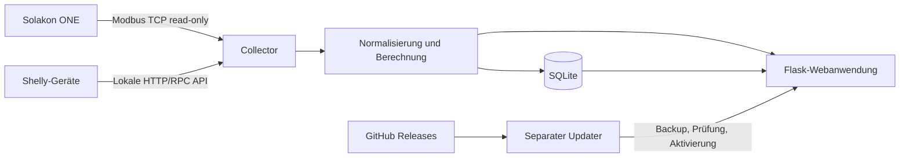

# SolarInspector

[](https://github.com/zrzavywa/SolarInspector/releases)
[](https://www.python.org/)
[](docs/installation-raspberry-pi.md)

**SolarInspector** ist eine lokal betriebene Webanwendung zur Erfassung, Plausibilisierung und Auswertung einer Solakon-Photovoltaikanlage. Sie kombiniert Messwerte der **Solakon ONE** mit unabhängigen **Shelly-Leistungsmessungen**, speichert Zeitreihen in SQLite und stellt Livewerte sowie Tages-, Wochen- und Jahresauswertungen im Browser bereit.

> Dokumentationsstand: SolarInspector **4.1.3**  
> Primärplattform: Raspberry Pi OS beziehungsweise Debian-basierte Linux-Systeme

## Hauptfunktionen

- Lokales Dashboard ohne Cloud-Zwang
- Solakon-ONE-Anbindung über **read-only Modbus TCP**
- Unterstützung für Shelly PM Mini Gen 3, Shelly 3EM Gen 1 und Shelly Pro 3EM
- Vergleich von Solakon- und Shelly-Messwerten
- Berechnung von Hausverbrauch, Eigenverbrauch, Autarkie sowie Netzbezug und Einspeisung
- Speicherung der Messwerte in einer lokalen SQLite-Datenbank
- CSV-Export und Diagnosefunktionen
- GitHub-basierte Updates mit Prüfsumme, Backup, Healthcheck und Rollback

## Unterstützte Messquellen

| Aufgabe | Unterstützte Quelle |
|---|---|
| Solaranlage | Solakon ONE über Modbus TCP |
| Unabhängige AC-Messung | Shelly PM Mini Gen 3 |
| Hausanschluss | Shelly 3EM Gen 1 |
| Hausanschluss | Shelly Pro 3EM |
| Testbetrieb | Integrierte Simulation |

Die tatsächlich verfügbaren Werte hängen von der Gerätefirmware, der lokalen Verdrahtung und der konfigurierten Messquelle ab.

## Messmodell

SolarInspector verwendet am Hausanschluss folgende Vorzeichenkonvention:

- **positiver Wert** = Netzbezug
- **negativer Wert** = Einspeisung

Vereinfachte Berechnungen:

```text
Hausverbrauch       = Solarleistung + Netzleistung
Eigenverbrauch      = min(Solarleistung, Hausverbrauch)
Eigenverbrauchsquote = Eigenverbrauch / Solarertrag
Autarkiegrad        = Eigenverbrauch / Hausverbrauch
```

Liefert ein Messgerät das umgekehrte Vorzeichen, kann die Messrichtung in der Konfiguration mit `direction_factor: -1` korrigiert werden.

## Schnellstart

1. Die [Installationsanleitung für Raspberry Pi](docs/installation-raspberry-pi.md) lesen.
2. Solakon ONE und/oder Shelly-Geräte im lokalen Netzwerk vorbereiten.
3. `config.json` aus `app/config.example.json` ableiten.
4. SolarInspector starten und im Browser öffnen.
5. Unter **Konfiguration** die Geräteverbindungen testen.
6. Erst danach die automatische Datenerfassung aktivieren.

Standardmäßig wird die Anwendung auf Port `8787` bereitgestellt.

```text
http://<IP-DES-RASPBERRY-PI>:8787/
```

## Dokumentation

| Thema | Dokument |
|---|---|
| Übersicht | [Dokumentationsindex](docs/README.md) |
| Raspberry-Pi-Installation | [Installation](docs/installation-raspberry-pi.md) |
| Konfiguration | [Konfigurationsreferenz](docs/configuration.md) |
| Solakon und Shelly | [Unterstützte Geräte](docs/devices.md) |
| Betrieb und Sicherung | [Betriebshandbuch](docs/operation.md) |
| GitHub-Updates | [Update und Rollback](docs/updates.md) |
| Fehleranalyse | [Troubleshooting](docs/troubleshooting.md) |
| Architektur | [Architekturübersicht](docs/architecture.md) |
| REST-Schnittstellen | [API-Referenz](docs/api.md) |
| Sicherheit | [Sicherheitsmodell](docs/security.md) |
| Markenhinweise | [TRADEMARKS.md](TRADEMARKS.md) |
| Mitarbeit | [CONTRIBUTING.md](CONTRIBUTING.md) |
| Änderungen | [CHANGELOG.md](CHANGELOG.md) |

## Architektur in Kürze



Die 4.1-Reihe verwendet noch eine überwiegend kompakte Anwendungsstruktur. MQTT/Home-Assistant-Integration und die weitergehende Modularisierung werden in der [Architekturübersicht](docs/architecture.md) ausschließlich als Zielbild für Version 5.0 beschrieben.

## Sicherheitshinweis

SolarInspector ist für den Betrieb in einem vertrauenswürdigen lokalen Netzwerk vorgesehen. Die Weboberfläche sollte **nicht direkt aus dem Internet erreichbar** gemacht werden. Für externen Zugriff sind ein abgesicherter VPN-Zugang, TLS und zusätzliche Authentifizierung erforderlich.

Der Solakon-Zugriff ist ausschließlich lesend ausgelegt. SolarInspector verändert keine Ladeleistung, Betriebsart, SoC-Grenzen oder anderen Anlagenparameter.

## Unterstützung und Fehlerberichte

Vor einem Fehlerbericht bitte:

1. die installierte Version ermitteln,
2. den Service-Status und die letzten Logzeilen prüfen,
3. sensible Daten wie Kennwörter, Tokens, Seriennummern und interne IP-Adressen entfernen,
4. die Schritte zur Reproduktion beschreiben.

Fehler und Verbesserungsvorschläge können über die GitHub-Issues des Projekts gemeldet werden.

## Markenhinweise

SolarInspector ist ein unabhängiges Projekt und steht in keiner offiziellen Verbindung zu Solakon GmbH, Shelly Group oder Raspberry Pi Ltd. Die Produkt- und Markennamen werden ausschließlich zur Beschreibung der unterstützten Geräte und Plattformen verwendet.

**Raspberry Pi is a trademark of Raspberry Pi Ltd.**

Weitere Informationen enthält die Datei [TRADEMARKS.md](TRADEMARKS.md).

## Lizenz

Die geltende Lizenz ergibt sich aus der Datei `LICENSE` im Repository.
