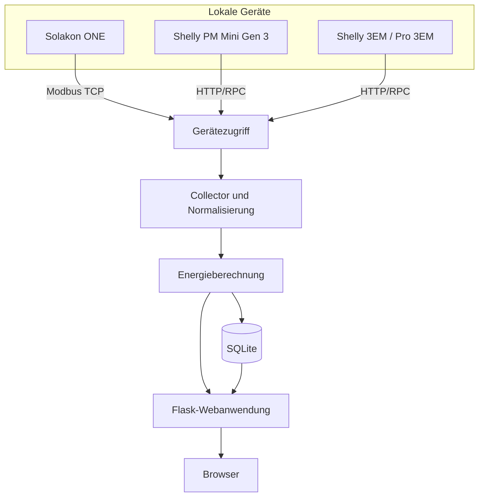
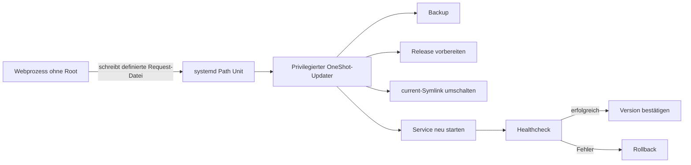

# Architektur

## Dokumentstatus

Dieses Dokument trennt zwei Ebenen:

1. **Ist-Architektur 4.1** – heute eingesetzte Struktur
2. **Zielarchitektur 5.0** – geplante Modularisierung

Damit werden geplante Komponenten nicht versehentlich als bereits implementiert dargestellt.

## Ist-Architektur 4.1

SolarInspector 4.1 ist eine lokale Python-/Flask-Anwendung mit folgenden Hauptbestandteilen:

- Weboberfläche und REST-Endpunkte
- Gerätezugriff für Solakon ONE und Shelly
- zyklische Messwerterfassung
- Normalisierung und Energieberechnungen
- SQLite-Persistenz
- Konfigurationsverwaltung über JSON
- GitHub-Releaseprüfung und Download
- separater privilegierter systemd-Updater

Die Anwendung ist funktional gegliedert, aber noch nicht vollständig in unabhängige Python-Pakete modularisiert.

## Laufzeitfluss



## Deployment-Layout 4.1

```text
/opt/solarinspector/
├── current -> releases/<aktive-version>
├── releases/
│   ├── <vorherige-version>/
│   └── <aktive-version>/
└── updater/

/etc/solarinspector/
└── config.json

/var/lib/solarinspector/
├── data/
│   └── solarinspector.db
├── backups/
├── update-request.json
└── update-status.json

/var/cache/solarinspector/
└── updates/

/var/log/solarinspector/
```

Jedes Release besitzt eine eigene virtuelle Python-Umgebung. Konfiguration und Datenbank liegen außerhalb des Release-Verzeichnisses und werden in das aktive Release eingebunden.

## Updatearchitektur



### Sicherheitsgrenze

Der Webprozess:

- sammelt Messwerte,
- stellt Weboberfläche und API bereit,
- prüft und lädt bekannte Releases,
- besitzt keine allgemeinen Root-Rechte.

Der privilegierte Updater:

- wird als eng begrenzter OneShot-Service gestartet,
- arbeitet mit festen Pfaden,
- erstellt Backups,
- bereitet ein neues Release vor,
- schaltet den aktiven Symlink um,
- startet den Dienst neu,
- führt Healthcheck und Rollback aus.

## Datenmodell

Zentrale fachliche Größen:

| Entität | Beispiele |
|---|---|
| Gerät | ID, Typ, Rolle, Host, Aktivierung |
| Messwert | Zeitstempel, Quelle, Metrik, Wert, Einheit |
| Energieaggregation | Bezug, Einspeisung, Erzeugung, Verbrauch |
| Updatezustand | Phase, Versionen, Fortschritt, Meldung |
| Updatehistorie | Start, Ende, Ergebnis, Rollback |

SQLite ist für eine einzelne lokale Installation angemessen. Datenbankzugriffe sollten langfristig hinter einer klaren Repository-Schicht gekapselt werden.

## Nicht-funktionale Ziele

- **Sicherheit:** Webprozess ohne Root-Rechte
- **Verfügbarkeit:** kurzer, kontrollierter Neustart bei Updates
- **Wiederherstellung:** Rollback ohne Verlust von Messdaten
- **Nachvollziehbarkeit:** protokollierte Updateversuche
- **Portabilität:** primär Linux, Kernlogik möglichst plattformneutral
- **Wartbarkeit:** klare Modulgrenzen und Migrationen
- **Performance:** Updateprüfung blockiert die Messung nicht
- **Datenschutz:** keine lokalen Daten oder Geheimnisse in Releases

## Zielarchitektur 5.0 – geplant

Die geplante Struktur trennt Domänenlogik und technische Adapter deutlicher. Das Modul `mqtt` ist Teil dieses Zielbilds und nicht Bestandteil der dokumentierten 4.1-Laufzeit:

```text
solarinspector/
├── api/
├── collectors/
├── configuration/
├── database/
├── domain/
├── mqtt/
├── updater/
└── web/
```

Geplante Verantwortlichkeiten:

| Modul | Aufgabe |
|---|---|
| `collectors` | Geräteadapter und Messwerterfassung |
| `domain` | normalisierte Messwerte und Energielogik |
| `database` | Persistenz, Migrationen und Aggregationen |
| `configuration` | Schema, Defaults, Validierung und Migration |
| `web` | Dashboard und Bedienoberfläche |
| `api` | versionierte REST-Schnittstellen |
| `mqtt` | geplante Home-Assistant-Discovery und Zustände |
| `updater` | Prüfung, Installation, Healthcheck und Rollback |

## Architekturentscheidungen

| Entscheidung | Begründung |
|---|---|
| GitHub Releases statt `git pull` | reproduzierbare und prüfbare Artefakte |
| Side-by-side-Releases | atomare Aktivierung und schnelles Rollback |
| eigene venv pro Release | Dependency-Änderungen bleiben rollbackfähig |
| persistente Konfiguration außerhalb des Releases | Updates überschreiben keine lokalen Einstellungen |
| SQLite | lokal, einfach und ausreichend für einen Standort |
| manuelle Updatebestätigung | verhindert unbeabsichtigte Installationen |
| read-only Solakon-Zugriff | Monitoring ohne Eingriff in den Anlagenbetrieb |
