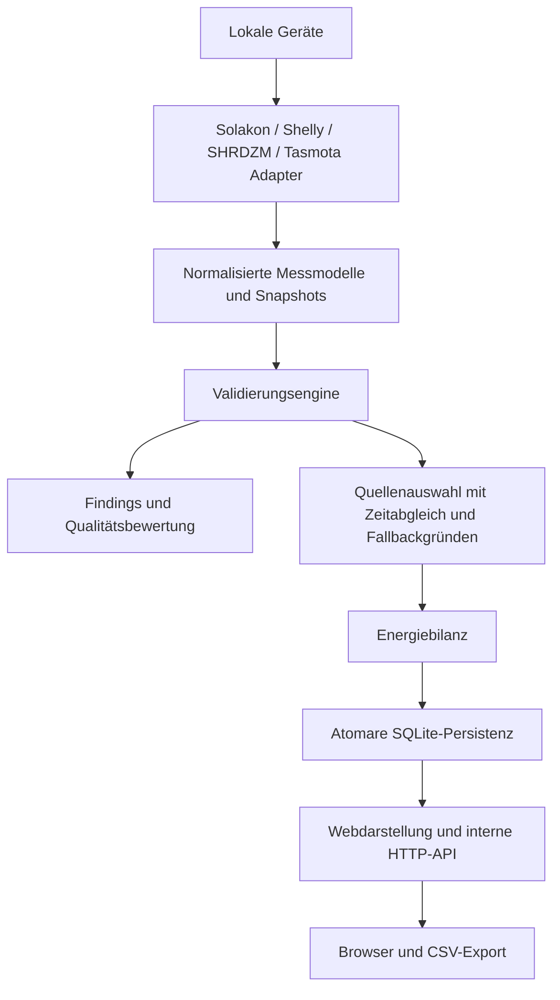
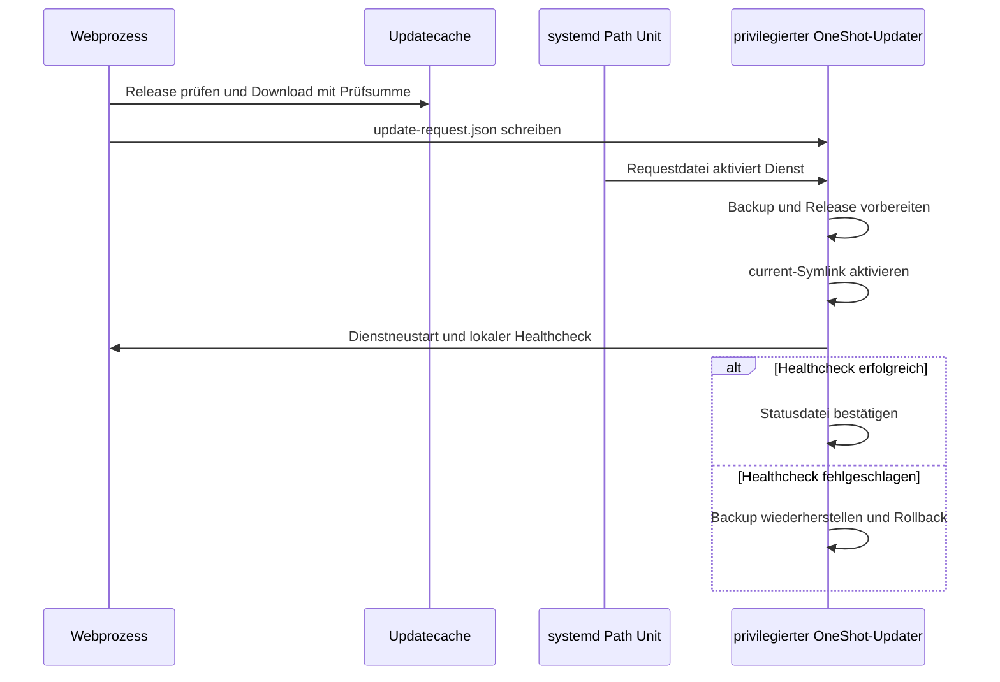

# Architektur

## Dokumentstatus und Geltungsbereich

Dieses Dokument beschreibt den implementierten Stand von **Zrzavy Energy Monitor 4.5.3**. Repositorypfade ohne Präfix sind relativ zur Repositorywurzel. Pfade unter `/opt`, `/etc`, `/var/lib`, `/var/cache` und `/var/log` sind Deploymentpfade, keine Repositorypfade.

Die Abschnitte „Ist-Architektur 4.5“ und „Zielarchitektur 5.0 – geplant“ sind bewusst getrennt. MQTT, Home-Assistant-Discovery und eine versionierte externe API sind in 4.5 nicht implementiert.

## Ist-Architektur 4.5

Der kanonische Entrypoint ist `app/zrzavy_energy_monitor.py`; die fachlichen Core-Module liegen im Namespace `app/zrzavy_energy_monitor_core/`. `app/solarinspector.py` und `app/solarinspector_core/` sind schmale, temporäre Legacy-Kompatibilitätswrapper für 4.5.

### Komponentenübersicht

| Verantwortung | Implementierte Pfade |
|---|---|
| Entrypoint und Flask-Routen | `app/zrzavy_energy_monitor.py`, `app/zrzavy_energy_monitor_core/web/` |
| Adapter und Factory | `app/zrzavy_energy_monitor_core/adapters/`, `app/modbus_solakon.py`; Solakon, Shelly, SHRDZM REST und Tasmota HTTP; `grid_meter_factory.py` |
| Konfiguration | `app/zrzavy_energy_monitor_core/config/`, `app/config.example.json` |
| Normalisierte Modelle | `app/zrzavy_energy_monitor_core/models/` |
| Validierung und Findings | `app/zrzavy_energy_monitor_core/validation/` |
| Collector, Auswahl, Zeitabgleich, Energiebilanz | `app/zrzavy_energy_monitor_core/services/` |
| SQLite, Migrationen, Zeitreihen, Retention | `app/zrzavy_energy_monitor_core/persistence/` |
| Webdarstellung und interne HTTP-API | `app/zrzavy_energy_monitor_core/web/`, `app/templates/`, `app/static/`; unversioniert und primär intern |
| Update | `app/github_updater.py`, `app/update_status.py`, `app/release_installer.py`, `app/updater_service.py`, `updater/`, `systemd/` |
| Migration und Kompatibilität | `app/zrzavy_energy_monitor_core/direct_migration.py`, `environment.py`, `paths.py`, `scripts/migrate-to-zrzavy-energy-monitor.sh` |

### Messwert- und Datenfluss


```mermaid
flowchart TD
    D[Lokale Geräte] --> A[Solakon / Shelly / SHRDZM / Tasmota Adapter]
    A --> N[Normalisierte Messmodelle und Snapshots]
    N --> V[Validierungsengine]
    V --> F[Findings und Qualitätsbewertung]
    V --> S[Quellenauswahl mit Zeitabgleich und Fallbackgründen]
    S --> E[Energiebilanz]
    E --> P[Atomare SQLite-Persistenz]
    P --> W[Webdarstellung und interne HTTP-API]
    W --> U[Browser und CSV-Export]
```

Adapter liefern rollen- und einheitenbezogene normalisierte Snapshots. Die Validierung erzeugt Findings; der Source Selector berücksichtigt Prioritäten, Messalter und maximalen Source-Skew und dokumentiert Fallbacks. Die Energiebilanz berechnet Netz-, Anlagen-, Batterie- und Residualgrößen.

### Persistenz, Migrationen, Retention und Export

`app/zrzavy_energy_monitor_core/persistence/database.py` und `app/zrzavy_energy_monitor_core/persistence/migrations.py` führen versionierte SQLite-Schema-Migrationen aus. Persistiert werden normalisierte Messwert-Zeitreihen, Phasenwerte, Energiebilanzen, Validierungsereignisse/Findings und – sofern aktiviert – Quellenentscheidungen. `app/zrzavy_energy_monitor_core/persistence/retention.py` implementiert eine standardmäßig deaktivierte, konfigurierbare und begrenzte Aufbewahrung; `app/zrzavy_energy_monitor_core/persistence/queries.py` bietet Zeitbereichsabfragen. `app/zrzavy_energy_monitor_core/web/export.py` stellt additive CSV-Exporte bereit. Das vollständige Schema steht in [docs/development/4.5/database-schema.md](development/4.5/database-schema.md).

### Web, Deployment und Laufzeitpfade

Die Webschicht trennt Response-Builder und Flask-Routen. Die installierte Anwendung liegt unter `/opt/zrzavy-energy-monitor/` mit `current`-Symlink und versionierten `releases/`; Konfiguration, Daten, Backups, Cache und Logs liegen getrennt unter `/etc/zrzavy-energy-monitor/`, `/var/lib/zrzavy-energy-monitor/`, `/var/cache/zrzavy-energy-monitor/` und `/var/log/zrzavy-energy-monitor/`. Release-venvs liegen je Release im Deploymentbaum.

### Update- und Rollbackarchitektur


```mermaid
sequenceDiagram
    participant Web as Webprozess
    participant Cache as Updatecache
    participant Path as systemd Path Unit
    participant Updater as privilegierter OneShot-Updater
    Web->>Cache: Release prüfen und Download mit Prüfsumme
    Web->>Updater: update-request.json schreiben
    Path->>Updater: Requestdatei aktiviert Dienst
    Updater->>Updater: Backup und Release vorbereiten
    Updater->>Updater: current-Symlink aktivieren
    Updater->>Web: Dienstneustart und lokaler Healthcheck
    alt Healthcheck erfolgreich
        Updater->>Updater: Statusdatei bestätigen
    else Healthcheck fehlgeschlagen
        Updater->>Updater: Backup wiederherstellen und Rollback
    end
```

`systemd/zrzavy-energy-monitor-updater.path` überwacht die Requestdatei; `systemd/zrzavy-energy-monitor-updater.service` begrenzt den privilegierten Updater. Updatecache, Request- und Statusdateien liegen unter den genannten `/var/lib`- beziehungsweise `/var/cache`-Deploymentpfaden.

### Legacy-Kompatibilität und direkte Migration

`scripts/migrate-to-zrzavy-energy-monitor.sh` und `direct_migration.py` unterstützen die direkte Migration von SolarInspector 4.1.3 auf Zrzavy Energy Monitor 4.5.0: Vorbedingungen, unveränderliches Backup, Konfigurations- und SQLite-Kopie, kanonische Dienste, Healthcheck und Rollback sind Teil des Ablaufs. Alte Pfade und Variablen werden nur im Legacy-Kontext erkannt; kanonische Pfade haben Vorrang.

### Sicherheitsgrenzen, Eigenschaften und Grenzen

Der Webprozess benötigt keine allgemeinen Root-Rechte. Nur der Updater darf privilegierte Installationsschritte ausführen. SQLite ist für eine lokale Einzelinstallation vorgesehen. Die Architektur garantiert keine allgemeine Hochverfügbarkeit; Hardware-, Netzwerk- und Herstellerfehler werden über Validierung, Qualitätsstatus und Fallbacks sichtbar gemacht.

## Zielarchitektur 5.0 – geplant

Die folgende Struktur ist ausschließlich ein Zielbild und kein Bestandteil der 4.5-Laufzeit:

```text
zrzavy-energy-monitor/  (geplant für 5.0)
├── api/                 (geplant, versionierte API)
├── collectors/          (geplant, entkoppelte Adapter)
├── domain/              (geplant, Domänenlogik)
├── database/            (geplant, Persistenz)
├── mqtt/                (geplant, MQTT und Home-Assistant-Discovery)
└── web/                 (geplant, Präsentation)
```

## Architekturentscheidungen

- Der kanonische Entrypoint und Namespace bleiben in 4.5 stabil; Legacywrapper sind zeitlich begrenzte Kompatibilität.
- Adapter, Modelle, Validierung, Auswahl, Energiebilanz, Persistenz und Web bleiben als getrennte Verantwortungen dokumentiert.
- SQLite und Side-by-side-Releases passen zum lokalen Betrieb und ermöglichen geprüfte Backups sowie Rollback.
- MQTT, Home Assistant und eine versionierte öffentliche API werden erst in einer ausdrücklich geplanten 5.0-Zielarchitektur betrachtet.
