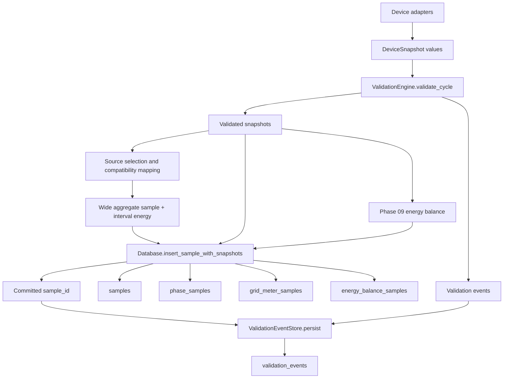
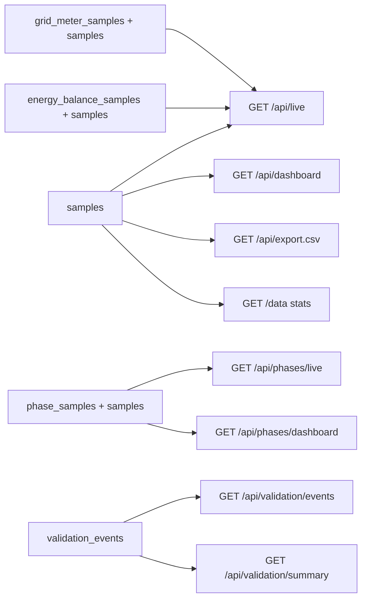

# Phase 10 persistence data flow

## Purpose

This document records every production write and read path on the Phase 09
baseline. It is descriptive: block 10.1 makes no product-code changes.

## Collector write path



`Collector.collect_once()` reads enabled devices, evaluates all snapshots in
one validation cycle, builds source selections and the energy balance, and
then builds the compatibility `samples` dictionary. Interval energy is
trapezoidally integrated from the previous and current accepted powers with a
maximum elapsed time of three polling intervals.

`Collector._insert_sample()` selects the richest database interface available
for backward-compatible test doubles:

1. `insert_sample_with_snapshots()`;
2. legacy Phase 05 `insert_sample_with_phase_snapshot()`;
3. legacy `insert_sample()`.

With the real `Database`, the aggregate, optional phase snapshot, optional
official-grid snapshot, and optional energy balance are inserted in one
transaction. Any detail failure rolls the entire sample back.

Validation events are persisted only after the aggregate transaction returns
its sample ID. They use a separate connection and transaction. Consequently,
a validation-event failure cannot roll back an already committed measurement
cycle. The collector treats event persistence as diagnostic and continues;
this is an intentional existing availability boundary to revisit explicitly,
not silently change.

Only validated snapshots enter compatibility selection, energy integration,
detail persistence, and the Phase 09 balance. Rejected measurement values are
removed from the accepted snapshot and survive only as sanitized validation
diagnostics. Warning-classified `suspect` values can remain usable according
to current validation and source-selection rules.

## Other write paths

| Caller | Write |
| --- | --- |
| `Database.initialize()` | Creates/extends all tables and indexes at object construction |
| Demo data service | Calls legacy-compatible `Database.insert_sample()` |
| `ValidationEventStore.persist()` | Inserts or deduplicates validation findings |
| `ValidationEventStore.prune_expired()` | Deletes expired validation findings when configured |
| `POST /api/delete-all` | Stops collector, deletes all five table contents, resets collector state |

`delete_all()` deletes child tables explicitly before `samples`, inside one
connection, and commits. It is user-triggered destructive behavior, not a
retention mechanism. It does not run `VACUUM`.

## Read paths



### Live API

`Database.latest()` selects the newest aggregate by `ts_epoch`.
`latest_grid_meter_sample()` and `latest_energy_balance_sample()` join their
detail table to `samples` and independently select the newest row. The live
payload can therefore combine detail rows from different collector cycles if
one optional detail is missing in the latest cycle. The API exposes decoded,
sanitized JSON metadata and calculated ages.

### Dashboard

The aggregate dashboard uses `rows_between(start, end)` and performs all
bucket aggregation and KPI summation in Python. The range is lower-inclusive,
upper-exclusive and sorted by epoch. Missing power values are ignored during
averaging; legacy interval-energy fields are summed. No SQL downsampling or
row-count ceiling exists.

The phase dashboard uses `phase_rows_between(start, end, source_id)` and also
aggregates in Python. Phase live uses `latest_phase_sample(source_id)`.

There is no historical grid-detail or energy-balance series API in the
baseline. The live API only exposes their latest rows.

### Validation API

Validation endpoints query `validation_events` directly through the
database connection provider:

- event listing filters a bounded time window and optional source, decision,
  and severity, with a limit of 1–500;
- summary calculates group and occurrence counts and groups by source;
- JSON diagnostic fields are decoded into safe public structures.

Queries are parameter-bound. The limited dynamic SQL only combines
application-owned clause fragments.

### CSV export

`GET /api/export.csv` keeps its legacy behavior when `dataset` is absent or
`legacy`: it parses local calendar dates, loads the matching `samples` range,
and writes the unchanged semicolon-separated 46-column compatibility CSV.
Extra database columns remain ignored. Missing nullable values become empty
fields, while historical `NOT NULL DEFAULT 0` compatibility fields retain
their existing behavior.

An explicit `dataset` adds bounded Phase-10 exports:

- `measurements` (requires `metric`, accepts optional `source_id`);
- `phases`;
- `grid`;
- `energy_balance`;
- `validation_events` (optional `metric` and `source_id`);
- `source_selection_events` (optional `metric`).

These paths read through the central time-series query layer and are limited
to 50,000 rows. Headers carry units either directly (`unit`) or in field names
such as `_w`, `_v`, `_a`, `_kwh`, `_percent`, and `_pct`. Parent sample times
are converted to UTC ISO 8601. Missing values remain empty and genuine zeroes
remain numeric zeroes.

The compatibility CSV still includes `solakon_serial` because removing it
would break its established contract. New exports do not include device
serials, metadata JSON, validation raw values/details, rejected-candidate
JSON, addresses, or credentials. Text beginning with spreadsheet formula
markers is prefixed with an apostrophe.

## Data representations by stage

| Stage | Representation | Missing/invalid handling |
| --- | --- | --- |
| Adapter candidate | Raw candidate values plus source/role/metric/unit/time | May temporarily contain invalid raw values for validation |
| Validated model | Strict finite `Measurement` objects in `DeviceSnapshot` | Rejected values absent; suspect values carry quality |
| Compatibility sample | Wide dictionary using legacy names | Most missing powers are `None`; legacy energy/status default to zero |
| Normalized details | Flattened phase/grid rows | Missing values `NULL`, valid zero preserved, partial quality coverage |
| Energy balance | Typed calculated result | Unavailable terms `NULL`; findings and source decisions in bounded JSON |

## Startup ordering

Application initialization now follows:

```text
secret validation
  -> read-only database inspection
  -> verified backup when migration is pending
  -> transactional migration and target verification
  -> Database construction
  -> one opt-in bounded retention transaction
  -> Collector construction
  -> Flask application construction
  -> optional Collector/webserver start
```

An exception at any database stage prevents every later stage. Current schema
2 is verified without a write. A failed migration is not retried within the
same process.
| Validation diagnosis | Deduplicated event row | Rejected accepted value `NULL`; bounded sanitized raw JSON retained |

## Duplicate and transitional structures

- Grid power exists in `samples.grid_power_w`,
  `grid_meter_samples.grid_power_w`, and
  `energy_balance_samples.grid_power_w`. These are compatibility aggregate,
  official-source snapshot, and selected balance input respectively; they are
  related but not interchangeable.
- Grid directions exist as legacy `grid_import_w`/`feed_in_w`, normalized
  official-grid direction columns, and balance direction columns.
- PV/plant power exists in several selected and device-specific `samples`
  columns and in the energy-balance row.
- Phase power totals can coexist in the aggregate sample, phase measurements,
  and phase-analysis columns.
- Source decisions exist as display labels in `samples`, an active stable ID
  in `grid_meter_samples`, and structured JSON in energy balances.
- Time is repeated as parent epoch/local text and detail ISO timestamps. These
  express collection, measurement, receipt, and calculation moments and must
  not be collapsed without preserving their meanings.

These repetitions arose through additive, backward-compatible phases. Block
10.2 must assign an authoritative representation and a documented
compatibility lifetime rather than create a fourth parallel structure.

## Transaction and failure boundaries

| Operation | Atomic boundary | Current failure result |
| --- | --- | --- |
| Aggregate plus Phase 05–09 details | One SQLite transaction | Full cycle write rolls back |
| Validation event group | Separate event-store transaction | Aggregate remains committed |
| Schema initialization | One connection, final explicit commit, DDL executed incrementally | No explicit rollback/verification contract |
| Validation pruning | Event-store connection/commit | Only validation rows affected |
| Delete all | One explicit child-to-parent deletion transaction | All data preserved if commit is not reached |

## Block 10.1 conclusions

All production tables, reads, writes, duplicates, and migration entry points
are accounted for. The next block can define a target schema without guessing:

- keep the wide table as a bounded compatibility layer or provide a complete
  read/export migration plan;
- introduce explicit schema versions before further additive migration;
- make accepted normalized metric time series authoritative where the current
  flattened details are incomplete;
- retain current selection, validation, persistence, and energy semantics;
- treat cumulative device counters separately from interval-integrated energy;
- preserve `NULL` versus real zero in all new representations;
- add historical query limits and measured indexes only after query-plan
  evidence;
- require verified backup and transactional migration tooling before any
  production upgrade.
