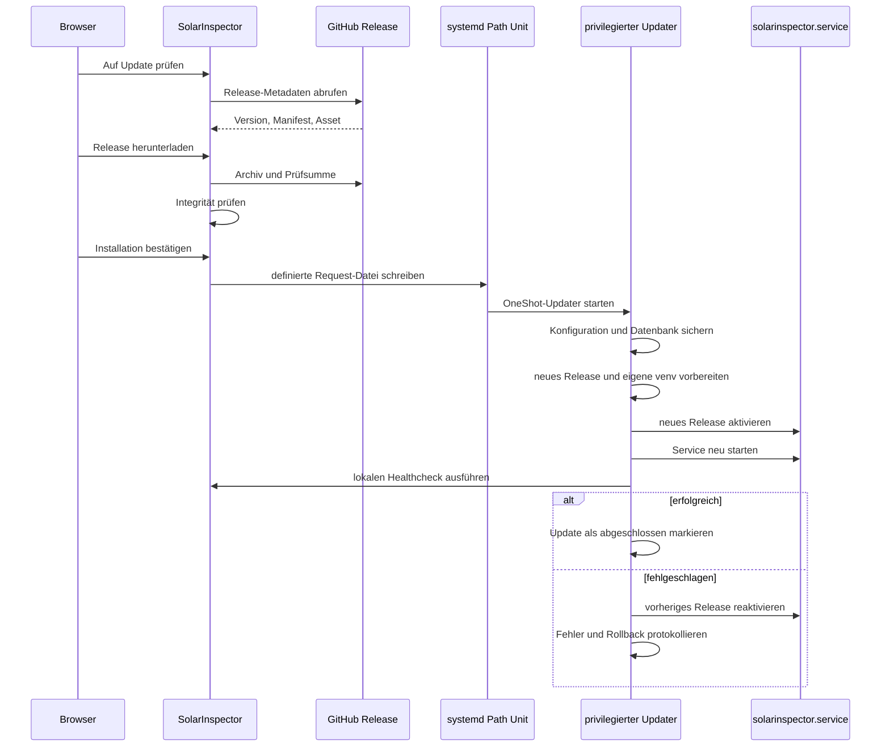

# GitHub-Updates und Rollback

## Grundprinzip

SolarInspector 4.1 trennt den normalen Webprozess vom privilegierten Updatevorgang.



## Warum ein separater Updater?

Der Webprozess soll keine allgemeinen Root-Rechte besitzen. Der privilegierte OneShot-Service akzeptiert nur eine eng definierte Updateanforderung und arbeitet mit festen lokalen Pfaden.

Dadurch werden unter anderem reduziert:

- Ausführung beliebiger Shell-Befehle,
- Installation aus fremden Repositories,
- Manipulation freier Zielpfade,
- unkontrollierte Dateizugriffe des Webprozesses.

## Voraussetzungen

Vor einem OTA-Update müssen funktionieren:

```bash
sudo systemctl status solarinspector.service
systemctl status solarinspector-updater.path
curl --fail http://127.0.0.1:8787/api/health
```

Zusätzlich:

- ausreichender Speicherplatz,
- funktionierender DNS- und HTTPS-Zugriff auf GitHub,
- schreibbare Laufzeit- und Cacheverzeichnisse,
- gültige persistente Konfiguration,
- aktuelle Systemzeit.

## Updateablauf in der Weboberfläche

1. **Auf Updates prüfen**
2. Release Notes und Versionsnummer kontrollieren
3. Release herunterladen
4. Prüfsumme und Manifest prüfen lassen
5. Installation ausdrücklich bestätigen
6. Fortschritt beobachten
7. nach Abschluss Version und Healthcheck kontrollieren

Ein Update darf nicht unbeaufsichtigt während einer laufenden Diagnose oder Datenmigration gestartet werden.

## Update-Status prüfen

```bash
cat /var/lib/solarinspector/update-status.json
```

Lesbarer formatiert:

```bash
python3 -m json.tool \
  /var/lib/solarinspector/update-status.json
```

Über die API:

```bash
curl --silent http://127.0.0.1:8787/api/update/status
```

Typische Statusphasen sind:

- Prüfung
- verfügbar
- Download
- Verifikation
- Backup
- Vorbereitung
- Aktivierung
- Healthcheck
- abgeschlossen
- fehlgeschlagen

Die exakten internen Bezeichnungen können sich zwischen Releases ändern.

## Aktives Release prüfen

```bash
readlink -f /opt/solarinspector/current
cat /opt/solarinspector/current/VERSION
```

## Updater-Logs

```bash
journalctl -u solarinspector-updater.service \
  -n 200 --no-pager
```

Path-Unit:

```bash
systemctl status solarinspector-updater.path
```

## Automatisches Rollback

Das Rollback wird ausgelöst, wenn die neue Version nicht erfolgreich aktiviert oder der lokale Healthcheck nicht innerhalb des vorgesehenen Zeitfensters erreicht wird.

Das Rollback soll:

- den vorherigen `current`-Symlink wiederherstellen,
- den SolarInspector-Service neu starten,
- den Fehler im Update-Status festhalten,
- Konfiguration und Messdaten erhalten.

Externe Messgeräte sind kein hartes Rollback-Kriterium. Ein nicht erreichbarer Shelly oder eine ausgeschaltete Solakon ONE darf die Anwendung nicht grundsätzlich als defekt einstufen.

## Manuelles Rollback

Vorhandene Releases anzeigen:

```bash
ls -la /opt/solarinspector/releases
readlink -f /opt/solarinspector/current
```

Auf eine bekannte funktionierende Version umschalten:

```bash
sudo systemctl stop solarinspector.service

sudo ln -sfn \
  /opt/solarinspector/releases/<VORHERIGE-VERSION> \
  /opt/solarinspector/current

sudo systemctl start solarinspector.service
curl --fail http://127.0.0.1:8787/api/health
```

Ein manuelles Rollback sollte im Betriebsprotokoll mit Datum, Ausgangsversion, Zielversion und Ursache dokumentiert werden.

## Backup wiederherstellen

Vor einer Wiederherstellung den Service stoppen:

```bash
sudo systemctl stop solarinspector.service
```

Backup zunächst in ein temporäres Verzeichnis entpacken und Inhalt prüfen. Nicht ungeprüft über das laufende System extrahieren.

Danach Besitzrechte kontrollieren:

```bash
sudo chown -R solarinspector:solarinspector \
  /etc/solarinspector \
  /var/lib/solarinspector
```

Anwendung starten und prüfen:

```bash
sudo systemctl start solarinspector.service
curl --fail http://127.0.0.1:8787/api/health
```

## Aufbewahrungsempfehlung

Mindestens behalten:

- aktives Release,
- unmittelbar vorherige funktionierende Version,
- letztes erfolgreiches Backup,
- letztes Backup vor einer Konfigurations- oder Datenbankmigration.

Release-Archive und Cachedateien dürfen erst nach erfolgreichem Betrieb und geprüftem Backup bereinigt werden.
